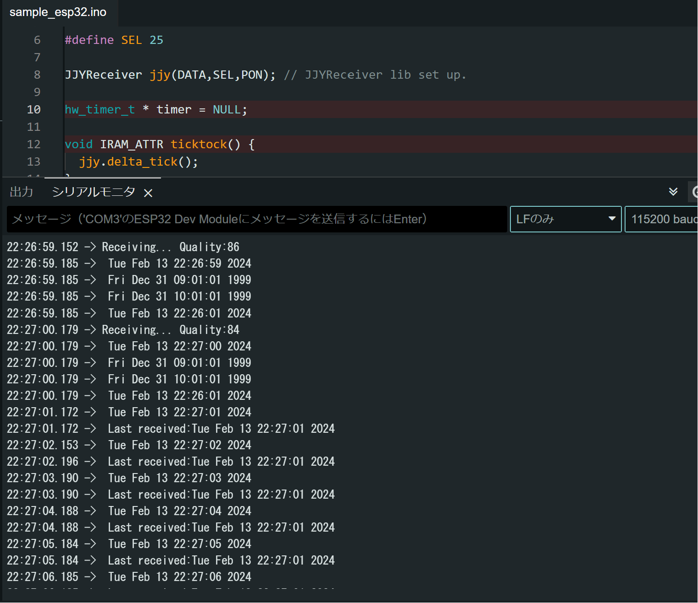

[](https://github.com/Blue-Crescent/JJYReceiver/actions/workflows/arduinolint.yml)

# JJY Receiver

JJY standard radio wave signal receiver library for arduino.

# 機能

JJYの日本標準時刻データを受信します。C言語標準のtime_t型のUTC基準＋9で時刻を返します。受信後は、タイマにより時刻を刻み維持することもできます。

電波時計モジュールをarduinoで利用しやすい形のJJY受信ライブラリ的なものがWebに見つけられなかったので作ってみました。

電波時計やデータロガーの日時情報など、低電力やインターネット未接続環境での時刻情報の利用ができます

# ハードウェア要件

- 10msecのタイマ
- 端子変化割り込み

を使用します。
10msecのタイマーはJJY受信時のサンプリング周期、及び時刻を刻む場合に使用します。
RTCなどを使用して時刻を維持し、マイコン側で時を刻まない場合、受信完了後タイマー動作は不要です。

端子変化割り込みは秒の基準信号とエッジ同期をはかるために使用します。
端子変化により、サンプリングデータの格納インデックスをリセットします。

最低限の端子要件は、JJY受信モジュールのデータ出力を一本、マイコンのピン変化割り込み入力端子につなげてください。その場合は受信モジュールの他の端子は適切な値に固定してください。

## 確認しているハードウェア

### マイコン

- lgt8f328p

できる限りアーキテクチャに依存しないように作っているつもりですが、uint64_tが16bitしか使えなかったり、発見したものを潰している感じですので、ハードウェア(コンパイラ)により対応できない場合があるかもしれません。esp32も所持しているので時間があるときに確認するかもしれません。

### JJY受信IC

写真には黄色のコンデンサがついていますが不要です。JJY受信モジュールはおおむねどれも似たようなインタフェースかと思いますが、負論理と正論理のものがあり手元にあるものは負論理モジュールでしたので、負論理と正論理の出力がある場合は負論理出力をつないでください。

利用したモジュールの参考：

- 製品番号: JJY-1060N-MAS
- 基板表記: MASD-S-R1 2020/05/27
- 受信IC: MAS6181B


| 基板シルク | 機能                                                                                                              | MAS6181B端子 | ライブラリコンストラクタ |
| ----- | --------------------------------------------------------------------------------------------------------------- | ---------- | ------------ |
| SEL   | L: 40kHz<br/>H: 60kHz                                                                                           | PDN1       | pinsel       |
| OUT   | JJYデータ出力 PWM<br/>P,M : 0.2sec Low - 0.8sec High<br/>H: 0.5sec Low - 0.5sec High<br/>L: 0.8sec Low - 0.2sec High | OUT        | pindata      |
| PON   | L: 動作<br/> H: 停止                                                                                                | PDN2       | pinpon       |
| GND   | 基準電位                                                                                                            | VSS        | -            |
| VDD   | 1.1~3.3 v                                                                                                       | VDD        | -            |

負論理出力でした。JJY信号の波形の立下りが1秒幅になります。

.jpeg)

JJY波形

.jpeg)

H

.jpeg)

L

.jpeg)

P,M

補足
lgt8f328pを使用する場合は、書き込み時にVccは5Vが出力されます。この受信モジュールは3.6Vが絶対最大定格ですので、書き込み時は受信モジュールを外すか、電圧レギュレーターをライタとの間に設けて保護してください。3.3Vでも書き込めました。


入手元:
https://ja.aliexpress.com/item/1005005254051736.html

# ソフトウェア

## 関数

### JJYReceiver(ピン番号)

    JJYReceiver(int pindata);
    JJYReceiver(int pindata,int pinpon);
    JJYReceiver(int pindata,int pinpon, int pinsel);

- pindata  JJYデータ入力端子の端子番号

- pinpon 電源動作（アクティブロー)

- pinsel 周波数選択 (L:40kHz, H:60kHz)

[Note] v0.4.0より変更

### begin()

JJYデータの受信を開始します。マイコンのクロック精度は、100ppmの発振器で2時間で1秒弱程度ずれますので、適宜受信してください。

[Note] v0.4.0より変更

### power(bool)

引数はtrueがモジュール動作状態、falseがモジュール停止状態です。

### freq(周波数)

受信周波数を設定します。

- 40kHzの場合40

- 60kHzの場合60

### monitor(ピン番号)

JJYモジュールの信号状態を(立ち上がりでH、立下りエッジでL)出力します。任意の出力端子にLEDなどを接続し電波状態を確認する目的で設けています。 デバッグ用です。不要の場合は呼び出さないか-1を設定してください。

JJYデータはLを含むデータが多いので、短めの点灯時間が多い場合は負論理出力、長めの点灯時間が多い場合は正論理出力です。

### delta_tick()

10msecおきに呼び出してください。JJYデータのサンプリング、時刻を刻む2つの用途で使用します。時刻を刻む場合はできる限り精度の高いクロックを利用したタイマーで呼び出すことを推奨します。

受信後RTCなどに時刻設定し、マイコン内部で時刻を維持する必要がない場合は、受信後呼び出す必要はありません。

### jjy_receive()

JJY受信モジュールのデータ出力をマイコンの端子変化割り込み対応の端子に接続し、その端子の変化割り込みルーチンで呼び出してください。

### getTime()

受信が完了しているかの確認に使用します。受信時刻を取得します。時刻が受信できていない場合は-1を返します。

getTime()が戻り値を返すには最低2つの内部の時刻受信データが一致する必要があります。JJYは1分かけて時刻情報を送信していますので、受信には最低2分かかります。良好な状態で3分程度、ノイズがある環境だと数分～受信不可となります。

[Note] v0.2.0より動作を変更

### get_time()

現在時刻を取得します。getTime()は受信時刻を指し停止するのに対して、こちらの時刻は受信中か否かにかかわらず常に時を刻んでいます。begin()により受信が成功すると時刻が校正されます。

delta_tick()が受信後も供給されている場合は、マイコンのクロック精度で刻んで維持している現在時刻が返されます。現在時刻が確定した時点で内部受信動作は停止します。再び受信動作を実行する場合はbegin()を呼び出します。

シリアル通信での表示方法の例。
その他、時分などを抽出したい場合はtm型に変換したあと、要素ごとに利用できます。
詳細はC言語のtime_t型で調べて下さい。

```
time_t now = jjy.get_time();
String str = String(ctime(&now));
Serial.println(str);
```

[Note]v0.2.0より追加

## 変数

オブジェクトからアクセスしてください。読み出しのみ。

アクセスの例

```
JJYReceiver jjy(DATA);

if(jjy.quality > 80){
    debugSerial.println("quality fine!");
}else{
    debugSerial.println("take me other place!");
}
```

### quality

1秒毎の受信ビットデータに対する目安の受信品質。大きいほうが良好。

- ビットの受信品質　0-100

### frequency

選択されている変調周波数を返します。

- 40:40kHz

- 60:60kHz

## サンプルスケッチ

サンプルスケッチの出力結果は以下の通りです。 受信中(time_tが-1の時)は2136年の時刻を指すようです。

受信した段階で受信した時刻に更新されます。秒は10msecタイマx100カウントでインクリメントします。



# デバッグモード

SoftwareSerialなどのシリアル通信ライブラリを有効にすることで、文字出力されます。
ヘッダファイル内の#define DEBUG_BUILDを有効にしてください。

左端に表示されている16進数の数値はサンプリングデータです。
データ判定結果が:の後にP,L,Hで表示され、それぞれマーカ、L、Hとなります。
そのあとにマーカの区間、受信状態を表示します。

受信中の中間データはlocaltime[0],localtime[1],localtime[2]のデータに格納されます。*は更新対象の時刻です。

Q:の手前の三つの数字はL,H,Pのマーカーとのハミング距離です。最大値96。サンプリングデータとCONST_L,CONST_H,CONST_PMそれぞれの配列との相関ですので、配列の内容を調整することで最適化できます。

Q:は受信品質を示します。ハミング距離から50%(ランダム一致を考慮)を差し引いた値からの一致具合の割合です。

```
0000000000000FFFFFFFFFFF:H MIN:RECEIVE 3 *Sat Feb 10 11:55:01 2024  Sun Feb 18 11:55:03 2024  Sat Feb 10 11:55:04 2024 =>Sat Jan 01 00:08:42 2000 68:92:72 Q:90
00000000000000000000FFFF:L MIN:RECEIVE 4 *Sat Feb 10 11:55:02 2024  Sun Feb 18 11:55:04 2024  Sat Feb 10 11:55:05 2024 =>Sat Jan 01 00:08:43 2000 96:72:44 Q:100
0000000000000000001FFFFF:L MIN:RECEIVE 5 *Sat Feb 10 11:55:03 2024  Sun Feb 18 11:55:05 2024  Sat Feb 10 11:55:06 2024 =>Sat Jan 01 00:08:44 2000 91:77:49 Q:88
000000000003FFFFFFFFFFFF:H MIN:RECEIVE 6 *Sat Feb 10 11:55:04 2024  Sun Feb 18 11:55:06 2024  Sat Feb 10 11:55:07 2024 =>Sat Jan 01 00:08:45 2000 62:86:78 Q:78
0000000000000000000FFFFF:L MIN:RECEIVE 7 *Sat Feb 10 11:55:05 2024  Sun Feb 18 11:55:07 2024  Sat Feb 10 11:55:08 2024 =>Sat Jan 01 00:08:46 2000 92:76:48 Q:90
0000000000001FFFFFFFFFFF:H MIN:RECEIVE 8 *Sat Feb 10 11:55:06 2024  Sun Feb 18 11:55:08 2024  Sat Feb 10 11:55:09 2024 =>Sat Jan 01 00:08:47 2000 67:91:73 Q:88
000007FFFFFFFFFFFFFFFFFF:P HOUR:RECEIVE 0 *Sat Feb 10 11:55:07 2024  Sun Feb 18 11:55:09 2024  Sat Feb 10 11:55:10 2024 =>Sat Jan 01 00:08:48 2000 37:61:89 Q:84
000000000000000000001FFF:L HOUR:RECEIVE 1 *Sat Feb 10 11:55:08 2024  Sun Feb 18 11:55:10 2024  Sat Feb 10 11:55:11 2024 =>Sat Jan 01 00:08:49 2000 93:69:41 Q:92
0000000000007FE000001FFF:L HOUR:RECEIVE 2 *Sat Feb 10 11:55:09 2024  Sun Feb 18 11:55:11 2024  Sat Feb 10 11:55:12 2024 =>Sat Jan 01 00:08:50 2000 83:65:51 Q:72
000000000000000000003FFF:L HOUR:RECEIVE 3 *Sat Feb 10 11:55:10 2024  Sun Feb 18 11:55:12 2024  Sat Feb 10 11:55:13 2024 =>Sat Jan 01 00:08:51 2000 94:70:42 Q:94
```

# アルゴリズム

## ハミング距離によるデータ判定

JJYのビットデータを10msec毎にサンプリングします。サンプリングの開始インデックスはJJYの信号変化でリセットされます。(負論理出力のモジュールの場合は立下りエッジ)
lgt8f328の場合は+-60msec程度揺らぐので、100サンプリングではな90サンプリング程度取得段階でハミング距離を計算しH,L,マーカのいずれかを判定します。

信号幅を測定したりする方法も実装してみましたが、ノイズが多く受信が困難だったためこの方式にしています。

https://www.nict.go.jp/sts/jjy_signal.html

## データ長のチェック

マーカー間のデータビット長をカウントして、正しいビット長があるかを検査します。ピット長が規定の長さを満たしていないものは破棄します。
これらはpayloadlenと呼ばれる配列にカウントデータを格納しlenchek関数で行っています。
分の情報は8ビット、その他は9ビットです。最後の曜日ビットは利用していませんので、対象外です。
曜日のデータは、受信したデータではなく、カレンダーの計算により算出されます。

## 時刻データのデコード

受信は3回分の受信データを保持しており、同一の時刻を2つ観測した段階で正式時刻として採用します。
2つデータが揃わない場合は2つ揃うまでデータを巡回して上書きしていきます。
時刻データはtime.hのtimeinfo構造体を利用して、JJYデータからUTC時刻に変換しtime_t型で管理します

40KHzでの動作確認をしています。

# TODOメモ

いつかやるかもしれない

- 受信高速化
  　マーカービットを待つことなく途中から受信したデータの再利用する
- リファクタリング
- 40kHz/60kHz自動選択

未定

- 本家Arduinoボード動作確認。未所持 Uno R4欲しいな～

# その他

ハードウェアのカンパ等歓迎します。開発に利用した場合、どのようなものに利用したか、感想なども歓迎します。(要望の実現・返信は必ずしも行いません)

バグ修正・エンハンスを歓迎します。パッチは受け付けていませんので、プルリクエストをお送りください。

GitHubの利用は初めてですので、お作法等ご容赦ください
