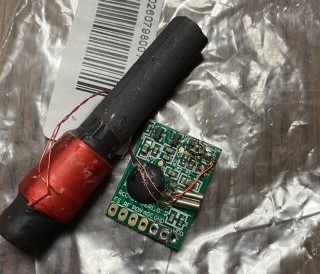
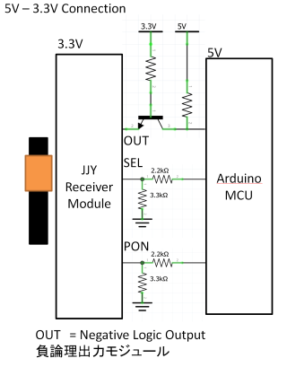
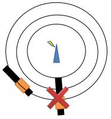

[](https://opensource.org/licenses/MIT)
[](https://github.com/Blue-Crescent/JJYReceiver/actions/workflows/arduinolint.yml)
[](https://registry.platformio.org/libraries/blue-crescent/JJYReceiver)

# JJY Receiver

Arduinoの日本標準時受信モジュール用ライブラリ

JJY standard radio wave signal receiver library for Arduino. 

For WWVB user, See bottom of this page.
It might be also works with WWVB by editing small modification. 

https://www.nict.go.jp/sts/jjy_signal.html

[](https://www.youtube.com/watch?v=x8oni1Ydn4E)


# 機能

JJYの日本標準時刻データを受信します。C言語標準のtime_t型のUTC基準＋9で時刻を返します。受信後は、タイマにより時刻を刻み維持することもできます。

電波時計モジュールをArduinoで扱いやすい形のJJY受信ライブラリ的なものがWebに見つけられなかったので作ってみました。

電波時計の制作やデータロガーの日時情報など、Wifiを利用せずとも電池駆動可能な低電力でインターネット未接続環境での時刻情報の利用ができます。

This library returns UTC date time of time_t type. Negative logic output type JJY receiver supported. Tested with JJY receiver IC MAS6181B with lgt8f328p/esp32.

# ハードウェア要件

- 10msecのタイマ
- 端子変化割り込み

を使用します。
10msecのタイマーはJJY受信時のサンプリング周期、及び時刻を刻む場合に使用します。
RTCなどを使用して時刻を維持し、マイコン側で時を刻まない場合、受信完了後タイマー動作は不要です。

端子変化割り込みは秒の基準信号とエッジ同期を計るために使用します。
端子変化により、サンプリングデータの格納インデックスをリセットします。

最低限の端子要件は、JJY受信モジュールのデータ出力を一本、マイコンのピン変化割り込み入力端子につなげてください。その場合は受信モジュールの他の端子は適切な値に固定してください。

## 確認しているハードウェア

### マイコン

- lgt8f328p
- ESP32 Dev module    [Note] v0.6.0より

できる限りアーキテクチャに依存しないように作っているつもりですが、uint64_tが16bitしか使えなかったり、発見したものを潰している感じですので、ハードウェア(コンパイラ)により対応できない場合があるかもしれません。

### JJY受信IC

写真には黄色のコンデンサがついていますが不要です。JJY受信モジュールはおおむねどれも似たようなインタフェースかと思いますが、負論理と正論理のものがあり手元にあるものは負論理モジュールでしたので、負論理と正論理の出力がある場合は負論理出力をつないでください。正論理モジュールの場合はおそらく、トランジスタを使って反転させると動作すると思われます。

#### 調達先

[電波時計モジュール - aitendo](https://www.aitendo.com/product-list?keyword=電波時計モジュール)

[JJY receiver 40kHz 60kHz –AliExpress](https://ja.aliexpress.com/w/wholesale-jjy--module.html?spm=a2g0o.productlist.search.0)

利用したモジュールの参考：

- 製品番号: JJY-1060N-MAS
- 基板表記: MASD-S-R1 2020/05/27
- 受信IC: MAS6181B


負論理出力でした。JJY信号の波形の立下りが1秒幅になります。

.jpeg)

JJY波形

.jpeg)

H

.jpeg)

L

.jpeg)

P,M

利用したモジュールの参考2：

- 製品番号: JJY-1060N-2R1
- 基板表記: RCC-02 VER1.0
- 受信IC: 不明 CME6005?

この基板はAGC端子を持ち、内部プルアップされていない？ためプルアップもしくはVDDに接続する必要があります。
また、周波数選択がH:40kHz, L:60kHzでした。

```
#define SWAPFREQ
```
をヘッダファイル内に定義することでL/Hを反転できます。(v0.8.5より)





# 回路

3.3V Normal Connection以外は確認したわけではありませんが、考えうる参考例です。





| 基板シルク                           | 機能                                                                                                                 | MAS6181B端子 | ライブラリコンストラクタ |
| ------------------------------- | ------------------------------------------------------------------------------------------------------------------ | ---------- | ------------ |
| SEL<br/>F、FSの場合もあり                             | L: 40kHz H: 60kHz<br/> L: 60kHz H: 40kHz(#define SWAPFREQをJJYReceiver.h内に定義)                                                                                            | PDN1       | pinsel       |
| OUT<br/>T、TN、TCO、RFなどと書かれている場合もあり。 | JJYデータ負論理出力 PWM<br/>P,M : 0.2sec Low - 0.8sec High<br/>H: 0.5sec Low - 0.5sec High<br/>L: 0.8sec Low - 0.2sec High | OUT        | pindata      |
| PON<br/>Pの場合もあり           | L: 動作<br/> H: 停止                                                                                                   | PDN2       | pinpon       |
| GND                             | 基準電位                                                                                                               | VSS        | -            |
| VDD                             | 1.1~3.3 v                                                                                                          | VDD        | -            |
| AGC      | L: AGC OFF H: AGC ON AGC端子を持つ場合はPullUp|AON|-|

補足
lgt8f328pを使用する場合は、書き込み時にVccは5Vが出力されます。受信モジュールが3.6Vが絶対最大定格の場合は、書き込み時は受信モジュールを外すか、電圧レギュレーターをライタとの間に設けて保護してください。3.3Vでも書き込めました。


# ソフトウェア

## 基本的な使い方

```
//#define SWAPFREQ  //周波数選択の出力論理を反転させる場合header内のdefineをアンコメント
#include <JJYReceiver.h>

#define DATA 39
#define PON 33
#define SEL 25

JJYReceiver jjy(DATA,SEL,PON); // JJYReceiver lib set up.
// JJYReceiver jjy(DATA); // 1pinにする場合

void setup() {
  // 10msec Timer for clock ticktock (Mandatory)
  タイマーの設定。ライブラリやレジスタ等を設定。
  ticktock()関数をタイマ呼び出しハンドラに登録

  // DATA pin 入力変化割り込み　(Mandatory)
  attachInterrupt(digitalPinToInterrupt(DATA), isr_routine, CHANGE);

  // JJY Library
  jjy.freq(40); // 受信周波数の設定

  jjy.begin(); // 受信の開始
  while(jjy.getTime() == -1); 

  jjy.begin(); // クロック補正用受信の開始(2回目の受信により、クロック補償を行いさらに高精度な内部クロック動作となります)
  while(jjy.getTime() == -1);// 受信が終わるまで次を実行させない場合に書く
}

void isr_routine() { // 入力信号変化割り込みで呼び出すハンドラ
  jjy.jjy_receive(); 
}
void ticktock() {  // 10 msecタイマで呼び出すハンドラ
  jjy.delta_tick();
}

void loop() {
  time_t now = jjy.get_time(); // 時間の利用。呼び出したときの現在時刻を取得
  time_t receive_time = jjy.getTime(); // 最後に電波を受信した時点の時刻の取得
  delay(100);
}
```

## インストール


## サンプルスケッチ

[サンプル](https://github.com/Blue-Crescent/JJYReceiver/tree/main/examples)

- minimumsample
  
  - 最低限の記述の例です。MSTimer2ライブラリの部分は、ライブラリがそのまま適用できない場合は、お使いのマイコンのアーキテクチャのタイマーを設定して10msecを作ってください。

- lgt8f328pで確認しています。

- _esp32が付いている名称のものは、ESP32で確認しているサンプルです。

## 関数

### JJYReceiver(ピン番号)

    JJYReceiver(int pindata);
    JJYReceiver(int pindata,int pinpon);
    JJYReceiver(int pindata,int pinsel,int pinpon);

- pindata  JJYデータ入力端子の端子番号

- pinsel 周波数選択 (L:40kHz, H:60kHz 又は　L: 60kHz H: 40kHz(#define SWAPFREQをJJYReceiver.h内に定義時))

- pinpon 電源動作（アクティブロー)

[Note] v0.4.0より変更、0.8.5より反転追加

### begin()

JJYデータの受信を開始します。マイコンのクロック精度は、100ppmの発振器で2時間で1秒弱程度ずれますので、適宜受信してください。
現在時刻が確定した時点で、getTime()が受信完了時刻を返し、内部受信動作は停止します。再び受信動作を実行する場合はbegin()を呼び出します。


- ソフトウエアSlew機能 [Note] v1.1.1より追加
RTCなどで時刻を管理せずこのライブラリの内部管理時刻(get_time())を取得して利用する場合は、初期動作時は2回受信を実行することを推奨します。
その後の計時動作がより正確になります。(行わなくても理論値10msecのタイマ間隔が実際の10msecに一致している前提で動作はします)

```
  jjy.begin(); // 初回受信の開始
  while(jjy.getTime() == -1); // 初回受信完了待ち
  jjy.begin(); // 刻み幅校正用受信の開始。以降JJYにて測定したタイマ校正値を利用して計時します。
```


[Note] v0.4.0より変更

### stop()

JJYデータの受信動作を中断します。受信モジュールのパワーダウン制御を行います。

### freq(周波数)

受信周波数を設定します。

- 40kHzの場合40

- 60kHzの場合60

- 自動周波数選択させる場合0

周波数指定しないでbegin()した場合、自動周波数選択動作をします。
周波数が選択できない受信モジュールを利用する場合は無効です。freq()で周波数を指定して使ってください。

### monitor(ピン番号)

JJYモジュールの信号状態を(立ち上がりでH、立下りエッジでL)出力します。任意の出力端子にLEDなどを接続し電波状態を確認する目的で設けています。 デバッグ用です。不要の場合は呼び出さないか-1を設定してください。

JJYデータはLを含むデータが多いので、短めの点灯時間が多い場合は負論理出力、長めの点灯時間が多い場合は正論理出力です。

### delta_tick()

10msecおきに呼び出してください。JJYデータのサンプリング、時刻を刻む2つの用途で使用します。時刻を刻む場合はできる限り精度の高いクロックを利用したタイマーで呼び出すことを推奨します。

受信後RTCなどに時刻設定し、マイコン内部で時刻を維持する必要がない場合は、受信後呼び出す必要はありません。

### jjy_receive()

信号変化を検知する目的で利用しています。
JJY受信モジュールのデータ出力をマイコンの端子変化割り込み対応の端子に接続し、その端子の変化割り込みルーチンで呼び出してください。
端子変化割り込みに対応する端子はマイコンによっては、端子が限定されている場合があるので、気をつけてください。

### getTime()

受信が完了しているかの確認に使用します。最後の受信時刻を取得します。時刻が受信できていない場合は-1を返します。

getTime()が戻り値を返すには最低2つの内部の時刻受信データが一致する必要があります(3分ぶんのバッファ)。JJYは1分かけて時刻情報を送信していますので、受信には最低2分かかります。良好な状態で3分程度、ノイズがある環境だと数分～受信不可となります。

v0.6.0より

begin()により受信が成功後のgetTime()の初回呼び出し時にJJY受信データの変換が行われて時刻が校正され、内部管理時刻に反映されます。(esp32では割り込みハンドラ内でmktime計算が実行できないため、変換処理は外部から呼び出す必要がある。受信完了後、すぐ呼び出さないと内部管理時刻への反映遅れによりずれます。-1以外の値が返るまで1秒以内のループ文中で呼び出して下さい)

[Note] v0.6.0より動作変更

### get_time()

現在時刻を取得します。getTime()は受信時刻を指し停止するのに対して、こちらの時刻は受信中か否かにかかわらず常に時を刻んでいます。

delta_tick()が受信後も供給されている場合は、マイコンのクロック精度で刻んで維持している現在時刻が返されます。

シリアル通信での表示方法の例。
その他、時分などを抽出したい場合はtm型に変換したあと、要素ごとに利用できます。
詳細はC言語のtime_t型で調べて下さい。

```
time_t now = jjy.get_time();
String str = String(ctime(&now));  // Sat Feb 17 18:45:40 2024\n
Serial.println(str);
```

```
time_t now = jjy.get_time();
tm tm_info;
localtime_r(&now, &tm_info);
char buf1[24];
strftime(buf1, sizeof(buf1), "%Y/%m/%d(%a) %H:%M:%S", &tm_info); // 2024/02/17(Sat) 18:45:40
Serial.println(buf1);
```

```
time_t now = jjy.get_time();
tm tm_info;
localtime_r(&now, &tm_info);
if(tm_info.tm_min == 0){
// 毎正時 00分に実行
}
```

[Note]v0.2.0より追加

## 変数

オブジェクトからアクセスしてください。読み出しのみ。

アクセスの例

```
JJYReceiver jjy(DATA);

if(jjy.quality > 80){
    debugSerial.println("quality fine!");
}else{
    debugSerial.println("take me other place!");
}
```

### quality

1秒毎の受信ビットデータに対する目安の受信品質。大きいほうが良好。

- ビットの受信品質　0-100

### frequency

選択されている変調周波数を返します。

- 40:40kHz

- 60:60kHz

### autofreq

自動周波数選択モードになっているかを返します。

- 1:自動周波数選択

- 0:手動指定

### calibrated 

2点間のJJY時刻を利用した1秒の刻み幅補償を行っているかどうかを返します。

- true:較正ずみ

- false:未較正

[刻み幅補正]

### jitter_us

最後のJJY受信時に計測されたジッタを返します。

- ジッタ量(標準偏差1σ, μsec)

[刻み幅補正]

### increment

1秒の刻みに必要なカウンタ量(分解能 μsec)
この変数は刻み幅補正により変化します。分解能はマイクロ秒ですが、10msecが量子化誤差となります。
マイコンのクロックドリフトの傾向が予め判明している場合は手動で書き換えておくことにより調整できます。(その場合、#TICK_CALIBRATIONをコメントアウト)
例:1秒が0.1%早く進むようなマイコン場合、0.1%増の値を設定します。

- 刻み幅(デフォルト 1000000)

[刻み幅補正]

### ideal_inc

最後のJJY受信時に計測された1秒を刻むための理想カウント量(分解能 μsec)を返します。

- 理想カウント量

[刻み幅補正]

### ppm_required_sec

刻み幅補正の精度を確保するために必要な離すべき受信間隔(秒)を返します。
JJYのジッタの影響がなくなる(10ppm,TARGET_PPM以下)ために必要な測定間隔

 - 最低の受信間隔(秒)

 次回のJJY受信をこの秒以上経過後に計測することで刻み幅補正に必要な目標精度(10ppm)が得られます。(JJYのジッタの影響を長期間の計測により薄めます)

[刻み幅補正]

### drift_ppm

内部クロックで自走期間中に発生した偏差

- 2点のJJY受信時刻から計算される理想カウンタ量と実際のカウンタ量の割合

一秒あたりのドリフト量、マイクロ秒として解釈することができます。

[刻み幅補正]

# デバッグモード

SoftwareSerialなどのシリアル通信ライブラリを有効にすることで、文字出力されます。
ヘッダファイル内の#define DEBUG_BUILDを有効にしてください。

左端に表示されている16進数の数値はサンプリングデータです。
データ判定結果が:の後にP,L,Hで表示され、それぞれマーカ、L、Hとなります。
そのあとにマーカの区間、受信状態を表示します。

受信中の中間データはjjydata配列に格納されます。jjypayload配列に各マーカー間のビットを格納します。

Q:の手前の三つの数字はL,H,Pのマーカーとのハミング距離です。最大値96。サンプリングデータとCONST_L,CONST_H,CONST_PMそれぞれの配列との相関ですので、配列の内容を調整することで最適化できます。

Q:は受信品質を示します。ハミング距離から50%(ランダム一致を考慮)を差し引いた値からの一致具合の割合です。

DEBUG_BUILD有効時のサンプル：

```
[2024-02-12 11:00:51.722] 00000000000001FFFC01FFFF:H MIN:RECEIVE 10 80:86:60 Q:78
[2024-02-12 11:00:52.722] 00000000007FFFFFFFFFFFFF:P HOUR:RECEIVE 9 57:81:83 Q:72
[2024-02-12 11:00:53.643] 0000000000000000000000FF:L HOUR:RECEIVE 10 88:64:36 Q:82
[2024-02-12 11:00:54.831] 00000000000000003FFFFFFF:H HOUR:RECEIVE 11 82:86:58 Q:78
[2024-02-12 11:00:55.832] 0000000000000000FFFFFFE0:H HOUR:RECEIVE 12 75:83:55 Q:72
[2024-02-12 11:00:56.832] 0000000000FFFFF03FFFFF00:P DOYH:RECEIVE 6 54:66:70 Q:44
[2024-02-12 11:00:57.832] 0000003FF800000000FFFF00:L DOYH:RECEIVE 7 69:61:47 Q:42
[2024-02-12 11:00:58.832] 000000000000000003FFFFFF:L DOYH:RECEIVE 8 86:82:54 Q:78
[2024-02-12 11:00:59.802] 00FFFFFFFFFFFFFFFFFFFFFF:P DOYL:RECEIVE 4 24:48:76 Q:58
[2024-02-12 11:01:00.803] 0001FFFFFFFFFFFFFFFFFFE0:M MIN:RECEIVE 0 26:50:78 Q:62
```

# アルゴリズム

正しい時刻データを抽出するためのアルゴリズム

## ハミング距離によるデータ判定

JJYのビットデータを10msec毎にサンプリングします。サンプリングの開始インデックスはJJYの信号変化でリセットされます。(負論理出力のモジュールの場合は立下りエッジ)
lgt8f328で観ていると+-60msec程度揺らぐので、100サンプリングではなく95サンプリング程度取得段階でハミング距離を計算しH,L,マーカのいずれかを判定します。
この辺の揺らぎはJJY受信モジュールのAGC自動ゲイン調整やノイズからくると推測されます。モジュールの癖なので、CONST_L,CONST_H,CONST_PMなどのHとLの期間調整を行うとさらに最適化することが出来ます。
チューニングしたい場合は、上記のデバッグモードを有効化して電波状態が良い時にシリアルログなどを保存しておき、最も頻出しているパターンを調べて調整を行うと良いと思います。

信号幅を測定したりする方法も実装してみましたが、ノイズが多く受信が困難だったためこの方式にしています。

## データ長のチェック

マーカー間のデータビット長をカウントして、正しいビット長があるかを検査します。ビット長が規定の長さを満たしていないものは破棄します。
これらはpayloadlenと呼ばれる配列にカウントデータを格納しlenchek関数で行っています。
分の情報は8ビット、その他は9ビットです。曜日のデータは、受信したデータではなく、カレンダーの計算により算出されます。

## 時刻データのデコード

受信は3回分の受信データを保持しており、同一の時刻を2つ観測した段階で正式時刻として採用します。
2つデータが揃わない場合は2つ揃うまでデータを巡回して上書きしていきます。
時刻データはtime.hのtm構造体を利用して、JJYデータからUTC時刻に変換しtime_t型で管理します

40KHz及び60KHz地域での動作確認をしています。

## パリティチェック

時刻データの正確性を確保するために、JJYデータの時分に付加されているPA2,PA1ビットを利用して偶数パリティによるチェックを行い、不正な場合、破棄します。（JJYプロトコルのみ利用可、#define PARITYCHKで制御）

## 曜日チェック

日付データの正確性を確保するために、西暦・通算日からZellerの公式を利用して簡易演算により曜日を算出し、JJYデータで配信されている曜日フィールドweekdayと一致するか検査します。一致していない場合は無効として扱います。（JJYプロトコルのみ利用可、#define WEEKDAYCHKで制御）

[数式整理memo]

要点
- JJYでは西暦・通算日が与えられるので、その年の1月1日の曜日を求め、次に通算日を足して曜日を算出する二段階で計算する
- 曜日をJJY形式で得るためにモジュロ計算前に+6しておく

|曜日|日|月|火|水|木|金|土|
|---|---|---|---|---|---|---|---|
|Zeller公式|1|2|3|4|5|6|0|
|JJY形式|0|1|2|3|4|5|6|

### Zellerの公式
```math
h = \left( d + \left\lfloor \frac{ 26 (m + 1) }{ 10 } \right\rfloor + k + \left\lfloor \frac k 4 \right\rfloor + \mathit \Gamma \right) \bmod 7
```
- Γはグレゴリオ暦を選択
```math
\Gamma = - 2 j + \left\lfloor \frac j 4 \right\rfloor
```
- j
```math
j = \left\lfloor \frac y { 100 } \right\rfloor 
```
- k
```math
k = y \bmod 100
```

### Zellerの公式(JJY形式、1月1日の曜日算出用)
1月1日は前年の13月として扱う。2025年1月1日の場合は2024(y)年13(m)月1(d)日。
```math
m = 13(1月), d = 1(1日), y = year -1
```

```math
h = \left( \left( 1 + \left\lfloor \frac{ 26 (13 + 1) }{ 10 } \right\rfloor + k + \left\lfloor \frac k 4 \right\rfloor  - 2 j + \left\lfloor \frac j 4 \right\rfloor \right) \bmod 7  + 6 \right) \bmod 7
```
```math
 = \left( 43 + k + (k \gt\gt 2)  - (j \lt\lt 1) +  ( j \gt\gt 2 ) \right) \bmod 7
```
- j (int型)
```math
j = y / 100 
```
- k (int型)
```math
 k = y - ( j \times 100)
```
kは除算結果がjで既にあるので、modより演算コストが低い引き算で算出する

## 自動周波数選択

自動選択の場合、次回受信時には成功した周波数から開始します。手動選択の場合は、freq()で再設定しない限り変更されることはありません。

周波数は以下の場合を想定し、切り替えています。

- P,Mフレームがしばらく検出できない場合(電波が受信できていない場合)

  payloadlenに格納されるマーカー間のビット数のカウントを見ています。
#define FREQTHRESHOLD1(>10)で切り替えカウントを指定。正常に受信されていれば9を超えることはありませんが、マーカーが認識されない場合はこのカウントが増えることを利用します。(設定は60カウント)

- P,Mフレームが検出されているが長らく受信に成功していない場合(ノイズが受信されてしまっていると考えられる場合)

  #define FREQTHRESHOLD2(>60)で切り替えカウントを指定。受信スタート時もしくは周波数切り替え時の時刻を記録しFREQTHRESHOLD2を超える秒数以上受信できていなかった場合に切り替えます。(設定は15分程度)

## 自動刻み幅補正（ソフトウェアSLEW）

安価なマイコン（内蔵RC発振子やセラミックレゾネータ使用時）のクロックドリフトをJJY受信タイミングで自動補正。
2回目以降のJJY受信時刻の前回受信時刻との経過秒と内部タイマによるカウンタを比較して理想カウント値からのずれを検出し、
クロック刻み幅を動的に調整して、経時による累積誤差を少なくします。

**更新ルール（2段階）**
1. **初回補正（初回JJY受信時、発振器製造個体差の補正）**
   
   - 2点のJJY受信時刻から刻み幅を決定

3. **以降の微調整（2回目以降、経年・温度・電圧等の環境変化ドリフト補正）**

   - 刻み幅調整による変化幅は、毎回の変更量を±1%以内に抑え、急激な変化（ノイズ・異常受信）を防ぎつつ、温度変化や経年ドリフトにゆっくり追従します。
  
  ** 作動条件**
  - 2点のJJY受信時刻間隔とJJY受信時のジッタ量から10ppm以上の精度を見込めるとき(前回の受信からの実時間経過（delta_true_sec）がppm_required_sec以上の秒数が経過している時)
  - 前回受信時からの実時間経過が約1.27年（40,000,000秒）未満以内の受信時
  - 2点のJJY受信時刻から計測されるカウンタの1秒当たりのズレ(ドリフト量)がJJY受信時のジッタ2σ以上の時

[Note] V1.1.1より。JJYジッタの計測はV1.2.0より

# 受信

受信のコツ。アンテナはなるべく回路のようなノイズ源から離しましょう。esp32であると10cm程度は、アンテナとICを離しておいたほうが良いです。
回路構成によっては、出力端子からMCU内部のノイズが放射されることがあります（LGT8F328P、LED_BUILTINのMONITOR出力で経験）。
受信がうまくできない、感度が低い場合は、すべての端子を入力にして、動作させないことも検討してみてください。

　  

# その他

ハードウェアのカンパ等歓迎します。開発に利用した場合、どのようなものに利用したか、感想なども歓迎します。(要望の実現・返信は必ずしも行いません)

バグ修正・エンハンスを歓迎します。パッチは受け付けていませんので、プルリクエストをお送りください。

GitHubの利用は初めてですので、お作法等ご容赦ください

Please feel free to send pull request about this library. If you have any enhancements or bugfix.
It seems similar time code format uses in WWVB. It may be also works with WWVB protocol by making small modification. I don't implement parity check functionality due to that.

I have put WWVB version code on another branch. [WWVB version](https://github.com/Blue-Crescent/JJYReceiver/tree/wwvb "See WWVB Branch")
I can't check WWVB modification will be worked or not. Because, I can't receive WWVB wave due to geographical reason.
If somebody report me it works or not, I might support it. If someone need my library. :D


