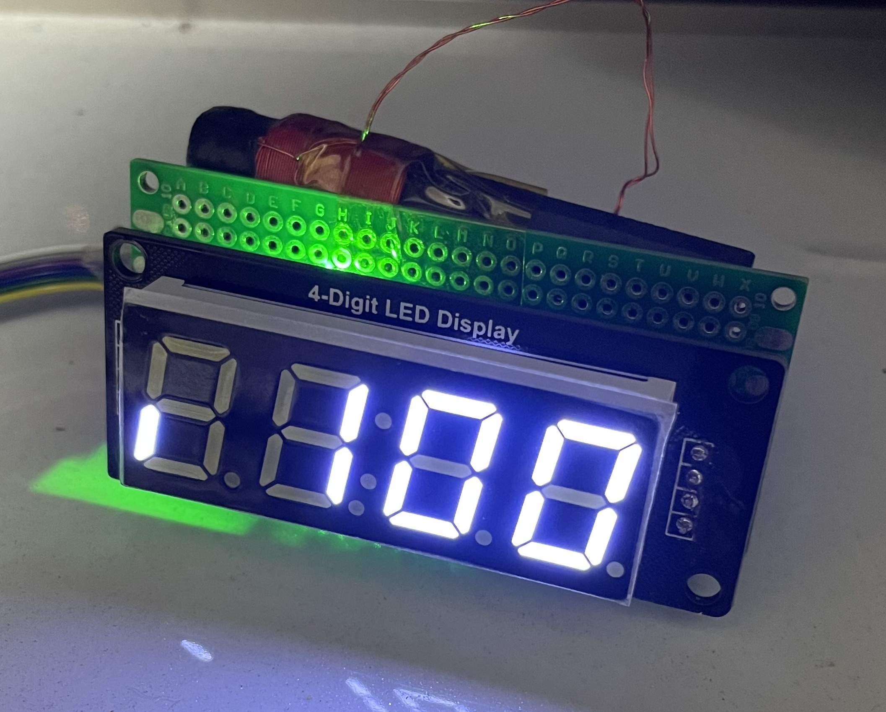
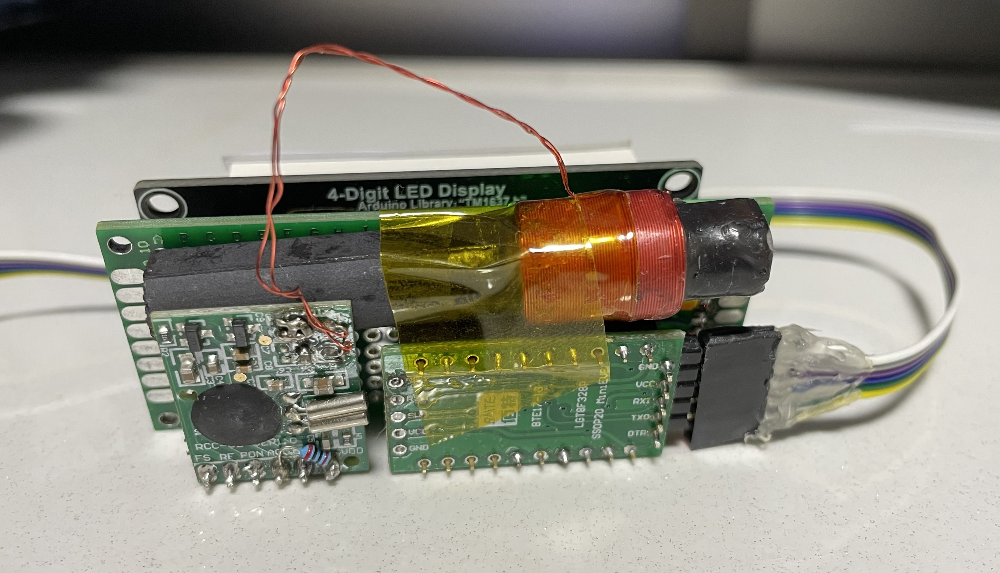
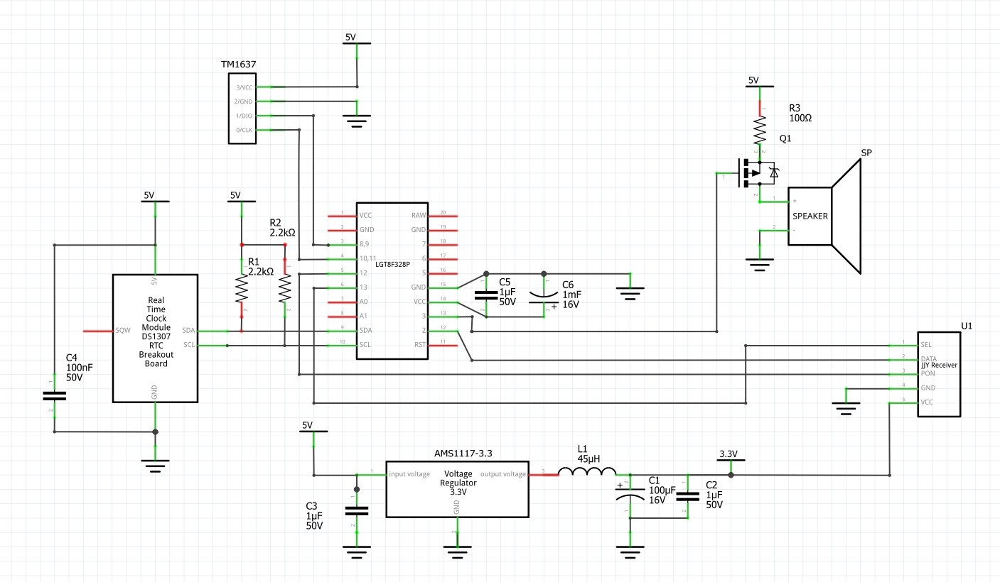

# 通常表示

# 初回電源投入時 感度表示

- 非受信時は:点滅点灯
- 受信中は:持続点灯

# 裏面

# 回路図

## ノイズに関する注意

DS1307のRTCのクロック出力を行うとノイズが発生するので、停止しておく

LGT8F328Pの場合はMONITOR_LEDを動作させるとノイズが出るので、基板上のLEDは使用しない

JJY受信機への電源はなるべくクリーンなものを供給する。手持ちのLDOがAMS1117だったのでLC回路を付けてノイズを低減させている
